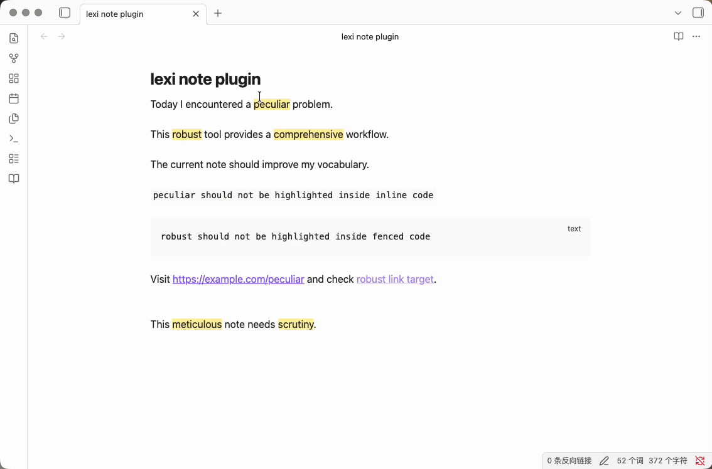

# LexiNote



[English](README.md) | [中文](docs/README_ZH.md)

Learn vocabulary while writing in Obsidian.

LexiNote automatically highlights difficult English words based on your level and helps you learn them without interrupting your writing flow.

## Features

- Highlight difficult words in real-time
- Hover to see meanings
- Add words to a personal vocabulary library
- Current document word list
- Vocabulary Library search, sorting, known markers, and deletion
- Built-in CET4 / CET6 dictionaries derived from ECDICT
- JSON / CSV / TXT custom dictionary import
- Optional fallback definition endpoint for words without local meanings

## Requirements

- Node.js 18 or newer
- npm
- Obsidian Desktop
- A local Obsidian vault for testing

## Status

First version implementation is OK. Core local features are available for manual testing.

## Development

Install dependencies:

```bash
npm install
```

Run unit tests:

```bash
npm test
```

Run type checking:

```bash
npm run typecheck
```

Build the plugin:

```bash
npm run build
```

Development build:

```bash
npm run dev
```

## Install Into A Local Vault

Replace `/path/to/TestVault` with your local Obsidian vault path:

```bash
mkdir -p "/path/to/TestVault/.obsidian/plugins/lexinote"
cp manifest.json main.js styles.css "/path/to/TestVault/.obsidian/plugins/lexinote/"
```

The plugin directory should contain:

```text
/path/to/TestVault/.obsidian/plugins/lexinote/
  manifest.json
  main.js
  styles.css
```

## Enable In Obsidian

1. Open the test vault in Obsidian.
2. Go to `Settings -> Community plugins`.
3. Turn off Safe mode if needed.
4. Refresh the installed plugins list.
5. Enable `LexiNote`.

After enabling, the left ribbon should show the LexiNote book icon.

## Local Acceptance Path

Use this quick note to verify the happy route:

````md
Today I encountered a peculiar problem.

This robust tool provides a comprehensive workflow.

`peculiar should not be highlighted inside inline code`

```text
robust should not be highlighted inside fenced code
```

Visit https://example.com/peculiar and check [[robust link target]].
````

Expected behavior:

- `peculiar`, `robust`, and `comprehensive` are highlighted in normal prose.
- Inline code, fenced code, URLs, and wikilinks are excluded.
- Hovering a highlighted word shows its meaning.
- The LexiNote ribbon icon opens the current document word list.
- The current document word list has a `My Vocabulary` button for opening Vocabulary Library.

For the full manual acceptance checklist, see [docs/4_LOCAL_TESTING.md](docs/4_LOCAL_TESTING.md).

## Custom Dictionary Import

LexiNote can import custom dictionaries from `JSON`, `CSV`, and `TXT` files.
Imported entries are stored locally in your Obsidian plugin data. The import UI
asks for a dictionary name and difficulty, and every imported word inherits those
values.

Custom dictionaries are language-flexible. LexiNote only needs the source word to
be English, while `meaning` can be Chinese, Japanese, Korean, French, or any
other target language you want to review. For example, the same English word can
be imported as English -> Chinese or English -> Japanese by changing only the
meaning text.

### JSON

Use an array of objects with `word` and optional `meaning` fields:

```json
[
  {
    "word": "meticulous",
    "meaning": "非常细致的；一丝不苟的"
  },
  {
    "word": "resilient",
    "meaning": "回復力のある；しなやかな"
  }
]
```

### CSV

Use a header row with `word,meaning`:

```csv
word,meaning
nuance,细微差别
cohesive,まとまりのある；結束した
elaborate,详细说明；精心制作的
```

### TXT

Use one English word per line:

```text
meticulous
resilient
scrutiny
```

TXT imports do not include local meanings, so hover cards and lists show
`暂无本地释义` unless a fallback definition endpoint is enabled.

### Test Fixtures

Sample files for local custom dictionary import testing are available in:

```text
tests/fixtures/imports/custom-academic.json
tests/fixtures/imports/custom-writing.csv
tests/fixtures/imports/custom-txt-words.txt
```

TXT imports do not include local meanings, so they are useful for validating the fallback definition flow.

## Fallback Endpoint Mock

Start a local fallback definition mock:

```bash
node -e 'const http=require("http");const meanings={meticulous:"非常细致的；一丝不苟的",scrutiny:"仔细审查；认真检查",resilient:"有恢复力的；有韧性的"};http.createServer((req,res)=>{res.setHeader("Access-Control-Allow-Origin","*");res.setHeader("Access-Control-Allow-Headers","Content-Type, Authorization");res.setHeader("Access-Control-Allow-Methods","POST, OPTIONS");if(req.method==="OPTIONS"){res.writeHead(204);return res.end();}if(req.method!=="POST"||req.url!=="/lookup"){res.writeHead(404);return res.end("not found");}let body="";req.on("data",c=>body+=c);req.on("end",()=>{const word=(JSON.parse(body||"{}").word||"").toLowerCase();res.setHeader("Content-Type","application/json");res.end(JSON.stringify({meaning:meanings[word]||`Mock definition for ${word}`}));});}).listen(8787,"127.0.0.1",()=>console.log("LexiNote fallback mock: http://127.0.0.1:8787/lookup"));'
```

Then configure LexiNote settings:

```text
Fallback API: on
Fallback endpoint: http://127.0.0.1:8787/lookup
Fallback API key: empty
```

The fallback client sends only:

```json
{
  "word": "meticulous"
}
```

## Release

eg: release version 0.1.1 to github

```bash
gh release create 0.1.1 manifest.json main.js styles.css \
  --title "0.1.1" \
  --notes "Release 0.1.1"

```

## License

MIT
